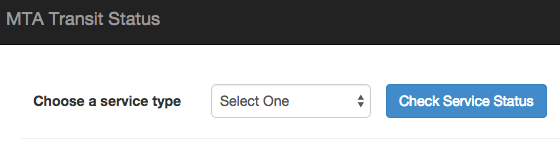
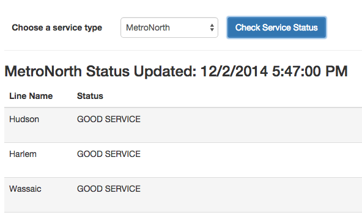
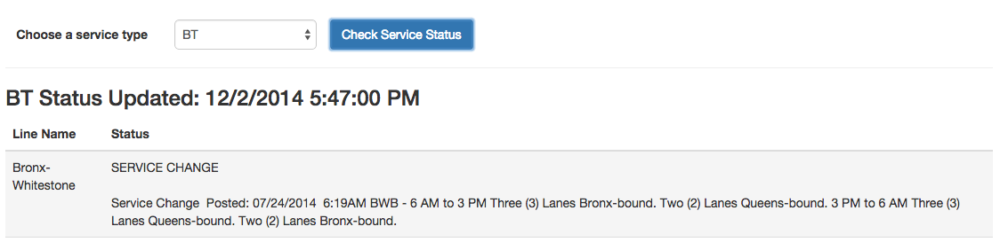

# mta-status
Requirements and examples for building an app that explores MTA statuses.

## Goal:
Create a web app to display NYC MTA Transit Status. Look and feel is up to you, so treat it as an opportunity to show off. You can use whatever client- or server-side technologies you’d like. Please send the relevant source code and get it live somewhere.

## Details:

- Data source (XML): http://web.mta.info/status/serviceStatus.txt (Yes, it says .txt, and the Content-Type header is text/plain, but the content is XML.)

## Content:

- Drop-down form to select service type (subway, bus, BT, LIRR, MetroNorth) to check status for that type
- On submit, display:
    - Service type selected
    - Timestamp of feed update
    - Line name
    - Line status
    - Service change if applicable
- (Optional) User logins with favorites and a separate view for favorites

## Deliverables:

- Source and link to app, PRed to this repository.  Earlier is also perfectly fine, and feel free to send over any questions as an issue in this repository (after first checking the Wiki to see if your question has already been answered there).

## Example Screens

- Choose service:

- Good service:

- Service changes:

